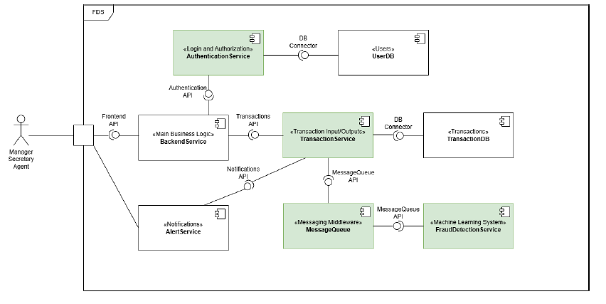
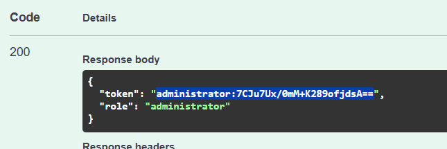
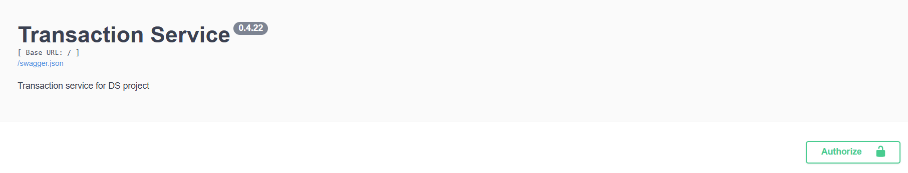
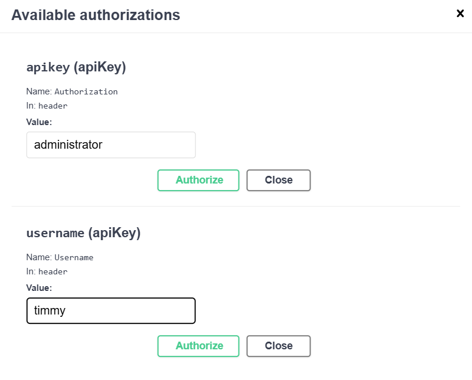

# Distributed Banking System
**by: Márió Palágyi @ IMC Krems**

*NOTE:* The application version names are always the latest deadlines.

## Table of Contents
1. Introduction
2. Used Libraries
3. Execution
4. Overview and Explanation of Modules
5. Modules and How They Depend on Each Other
6. Short Summary and Room For Improvement

## 1. Introduction
Based on the UML Component Diagram, the services of the Authentication and Transaction System were implemented, using Python. The components are yet separate, so the transaction system has no access to the tokens and usernames generated by the Authentication System. For this reason I used Flask provided capabilities and an Authorization function. It lets us create a username and role for the current session, which enables us to use the services. The logging is done, so the information goes into separate files: authentication_logging.log and transaction_logging.log.

Also the Results of the ML System are mocked, based on randomized results.

## 2. Used Libraries
The following libraries outside of the standard Python library were imported
- flask - for RESTful API
- flask-restx - for Swagger UI
- SQLAlchemy - for easier DB operations, uniform python code; SQLite engine
- requests - for API and HTTP handling
The representation of these libraries in the requirements.txt file contains all their dependencies and versions used at the time of development.

## 3. Execution:
1. Create venv (`python -m venv venv`)
2. Activate venv (`.\venv\Scripts\activate`)
3. Install dependencies (`pip install -r requirements.txt`)

*Execution for authentication service:*

1. Navigate to the auth_service/src folder and execute `python app.py` in terminal
2. Enter the URL `http://127.0.0.1:8000/` in browser
3. Follow the instructions below:
**Login with username and password**: 
...using this JSON
`{"username": "string", "password": "string"}`, enter to the username and password appropriately from the `usermodels.db` one of the following username - password combinations:
- username: mynames_admin - password: password123 | (this is our admin)
- username: agent_007 - password: Bond007 | (this is our agent)
- username: stacy - password: starbucks123 | (this is our secretary)

After entering valid credentials, see in the Response we get a token with role attached:

We copy everything between the quotation marks, we will use this for the Authentication function:
**Authentication function**:
We type in the correct username and token combination:
For example: 
- username: mynames_admin
- token: what we copied from the **Login** function
If it's correct we'll see the Response as "valid": true

*Execution for transaction service:*
1. Navigate to the transaction_service/src folder and execute `python app.py` in terminal
This step will create the database file: bank_system.db, which is SQLite. It contains 2 tables: results and transactions, with the mentioned fields from the Assignment_2.pdf
2. Enter the URL `http://127.0.0.1:8001/` in browser
3. Use the UI according to the instructions below:

For the fields, input either "agent" or "administrator" into the apiKey field and a username for the username field. I used "administrator" and "timmy"

We needed this step, since the two services are disconnected yet, I needed to create a solution that enables me to have a username and a token as well. Luckily, flask provided me with the necessary functions.
Now we can try out the functions.
/transactions
- Make a transaction: make sure to input a customer (the sender), a vendor ID (recipient) and an amount
- List existing transactions: Lists all existing transactions from the database
- Update status of transaction: for "status" input the text *submitted, rejected* or *accepted*.
- Query specific transactions: use the ID of an existing transaction

/results
- Get all predictions: Lists all results of existing transactions
- Get the prediction result of one specific transaction: use the ID of an existing result

## 4. Overview and Explanation of Modules
Currently, there are 2 separate folders, each containing the folders src and tests. So far, only the application code has been created, no testing, because of time constraints.
The auth_service/src folder contains additional files (that are not present before execution):
- app.py: the main program to be executed
- authentication.py: generate_token, verify_token and authenticate functions
- usermodels.py: contains classes for UserRole and User, and a dictionary - the in-memory cache of the existing users

The transaction_service/src folder also contains additional files (that are not present before execution):
- app.py: the main program to be executed
- dbmodels.py: contains the tables for the DB, using SQL Alchemy
- setupdb.py: Base, engine and Session

## 5. Modules and How They Depend on Each Other
Currently, the two system components, Authentication and Transaction are separate.

## 6. Short Summary and Room For Improvement
So far, the project is separated for to its components, but I believe they will depend on each other in the future. Some error and exception handling was added, but there is room for improvement in that regard, the system could also use unit testing. The Swagger UI is a great tool for understanding the components and a useful tool to visualize everything. Regarding the logging, there were some problems along the way, for example limiting Body text sizes, because some message is really long and takes up a lot of space. 
It also took a lot of effort to figure out the correct use of the Swagger UI and the decorators, namespaces and models/responses for the functions. I don't feel confident in my solution for that, but it works.

Here is an extremely useful link to HTTP response codes, which I used for my code:
https://developer.mozilla.org/en-US/docs/Web/HTTP/Reference/Status

Resources for errors and bugs: SQLAlchemy documentation, Flask documentation, Swagger documentation, StackOverflow, GitHub, YouTube - NeuralNine

Stop for April 22nd iteration; **Transaction Service and Authorisation Service implemented**
---